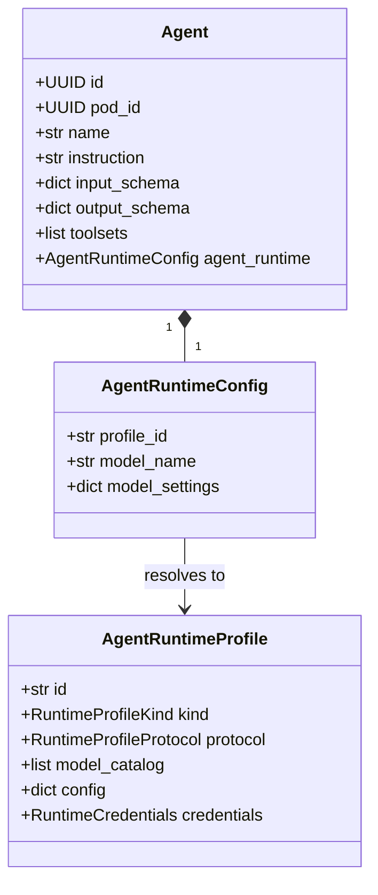
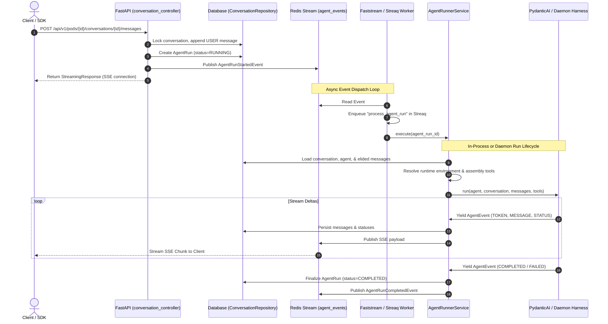
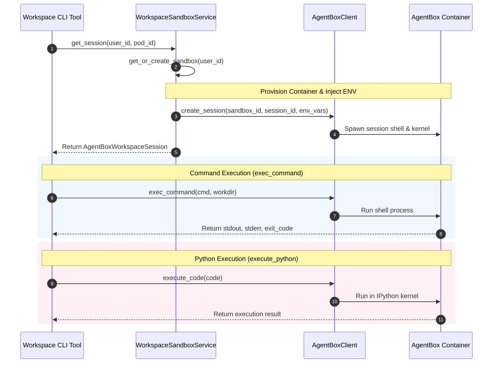

# Lemma Agent Runtime Architecture

This document provides a granular, source-level technical analysis of the Lemma Agent execution model. It outlines how agents are defined and configured, traces the lifecycle of an agent run from the client API to background execution, details context and history management, and explains tool injection and sandbox environment execution.

---

## 1. Agent Definition and Configuration

The agent runtime is governed by three core domain aggregates and configuration schemas:
1. **Agent Aggregate (`Agent` Pydantic model)**: Represents the static definition of an agent, including its `name`, `instruction` (system instructions), `input_schema`, `output_schema`, and authorized `toolsets`. Mapped in `app/modules/agent/domain/entities.py`.
2. **Agent Runtime Config (`AgentRuntimeConfig` / `HarnessOptions`)**: Specifies the execution settings, such as `profile_id`, the selected LLM `model_name`, temperature, or settings like history processors. Mapped in `app/modules/agent/domain/value_objects.py`.
3. **Runtime Profile (`AgentRuntimeProfile`)**: Represents system-wide or organization-scoped configurations mapping a provider protocol (e.g., `OPENAI_COMPATIBLE`, `ANTHROPIC_COMPATIBLE`, `CLAUDE_CODE`, `GOOGLE_VERTEX`) and its API endpoints/credentials. Mapped in `app/modules/agent/domain/runtime_profiles.py`.



### System Prompt Composition & Layering
System instructions are not treated as a single static block. Instead, they are dynamically composed per-run by `build_agent_instructions()` in `app/modules/agent/domain/prompts.py`. The instructions are constructed through the following layers, ordered from top to bottom:

1. **Base Assistant Prompt**:
   - For the system assistant: Loaded from `prompts/pod_assistant.md`.
   - For user-created agents: Loaded from `prompts/agent_base.md`.
2. **Toolset fragments**: Static guidance fragments associated with active toolsets (e.g., `prompts/workspace_cli.md` or `prompts/skills.md`). Included for external daemons but omitted for the local `LEMMA` harness (which registers them dynamically via PydanticAI capabilities).
3. **Surface Platform Guidance**: Specific instructions appended for the surface platform (e.g. Email reply guidelines or Slack interactions) resolved via `platform_agent_guidance()`.
4. **Working Directory Sandbox Context**: Dynamically injects a section clarifying the current workspace path (e.g. `/workspace/conversations/{conversation_id}`), instructions on installing dependencies using `pip install`, and how to export deliverables with the `lemma` CLI.
5. **Agent-specific Instruction**: The custom `instruction` defined on the `Agent` model.
6. **Conversation-specific Instructions**: Custom instructions defined on the `Conversation` model (`conversation.instructions`).
7. **Runtime Context Brief**: A detailed brief describing the user, pod, and granted resource access paths, attached to `ctx.context_brief`.

---

## 2. Agent Execution Path

The execution flow of an agent run spans API routing, queue-based background worker dispatch, runner scheduling, and real-time SSE event streaming.



### Detailed Execution Trace

1. **Client Message Ingress**:
   - The SDK calls `POST /api/v1/pods/{pod_id}/conversations/{conversation_id}/messages` (handled by `send_message` in `conversation_controller.py`).
   - The route calls `ConversationService.add_user_message_and_start_run()`.

2. **Transaction & Run Registration**:
   - `add_user_message_and_start_run()` locks the conversation using `lock_conversation(conversation.id)`.
   - If there is no active run, it creates a new `AgentRun` entry in the database.
   - It appends the user's message as a `Message` entity with `role="user"`.
   - It commits the transaction and publishes an `AgentRunStartedEvent` to the `AGENT_EVENTS_STREAM` Redis stream.

3. **Worker Dispatch**:
   - The Faststream event subscriber `handle_agent_control_event()` in `app/modules/agent/events/handlers.py` reads the event.
   - It enqueues a background job `"process_agent_run"` inside Streaq (`enqueue_agent_run`).
   - The Streaq worker pick up the task and runs `process_agent_run`, passing it to the `AgentRunnerService.execute()`.

4. **Runner Scheduling & Harness Invocation**:
   - `AgentRunnerService.execute()` loads the conversation context (conversation, agent, run state, and history) via `_load_run_context()`.
   - It resolves the runtime profile using `AgentRuntimeProfileService.resolve()` to determine the harness type (e.g. `LEMMA` for local PydanticAI, or `CODEX`, `CLAUDE_CODE`, `OPENCODE` for external daemons).
   - It compiles the tools via `RunToolAssembler.assemble()`.
   - It starts an `anyio` cancel scope.
   - It calls the harness runner (`harness.run()`).

5. **Streaming & Event Handling**:
   - As the harness executes, it yields `AgentEvent` objects (e.g., `TOKEN`, `MESSAGE`, `STATUS`, `ERROR`, `COMPLETED`).
   - `AgentRunnerService._handle_harness_event` processes these events:
     - `TOKEN` events are pushed to the Redis pub/sub channel for immediate SSE streaming to the client.
     - `MESSAGE` events (such as text or tool calls) are persisted in the database via `message_writer.persist()` and broadcast to the client.
     - `COMPLETED`/`FAILED`/`STOPPED` events invoke `_finish_agent_run()`, which transitions the database run state, records usage, and publishes an `AgentRunCompletedEvent`.

---

## 3. Context and Memory Management

### History Loading and Context Window Elision
To prevent context window bloat and manage cost, the runner elides conversation history. This logic resides in `_select_runtime_history()` inside `app/modules/agent/services/agent_runner_service.py`:

```python
def _select_runtime_history(self, runs: list[AgentRun]) -> list[Message]:
    if len(runs) <= FULL_HISTORY_AGENT_RUN_COUNT:
        return [message for run in runs for message in run.ordered_messages()]

    recent_run_ids = {run.id for run in runs[-FULL_HISTORY_AGENT_RUN_COUNT:]}
    selected: list[Message] = []
    for run in runs:
        messages = run.ordered_messages()
        if not messages:
            continue
        if run.id in recent_run_ids or len(messages) <= 2:
            selected.extend(messages)
            continue

        skipped_count = max(0, len(messages) - 2)
        selected.append(messages[0])
        selected.append(
            Message(
                conversation_id=run.conversation_id,
                sequence=messages[0].sequence,
                agent_run_id=run.id,
                role=MessageRole.SYSTEM.value,
                kind=MessageKind.NOTIFICATION,
                text=(
                    "Earlier agent run summarized: "
                    f"worked through {skipped_count} intermediate messages."
                ),
                metadata={
                    "synthetic": True,
                    "summary_kind": "agent_run_middle_elision",
                    "elided_message_count": skipped_count,
                },
            )
        )
        selected.append(messages[-1])
    return selected
```

- **Full History**: The messages from the last `FULL_HISTORY_AGENT_RUN_COUNT` runs are preserved in their entirety.
- **Middle Elision**: For older runs, the engine keeps only the **first** message and the **last** message of that run, replacing the intermediate messages with a synthetic `SYSTEM` notification that details how many messages were elided.

### History Processors and Summarization
In addition to run-level elision, the local `LEMMA` harness uses token-based summarization.
- Mapped in `app/modules/agent/infrastructure/harnesses/history.py`.
- If `history_summarization_enabled` is active, it appends a summarization processor built using `create_summarization_processor` from the `pydantic_deep` package.
- It triggers a summarization prompt when history exceeds `history_summarization_token_limit`, condensing older context while keeping a minimum number of recent messages (`history_summarization_keep_messages`).

---

## 4. Tool Injection Model

Lemma provides a unified tool definition and mapping model. This ensures that the local `LEMMA` harness (PydanticAI) and external daemon harnesses (via MCP) invoke identical tools with identical arguments.

```
                  ┌───────────────────────┐
                  │   RunToolAssembler    │
                  └───────────┬───────────┘
                              │
         ┌────────────────────┼────────────────────┐
         ▼                    ▼                    ▼
┌──────────────────┐ ┌──────────────────┐ ┌──────────────────┐
│ Built-in Tools   │ │ Custom Functions │ │ Sub-Agent Tools  │
│ (Workspace CLI,  │ │ (AgentCallable-  │ │ (AgentCallable-  │
│ Web Search, etc) │ │  ToolFactory)    │ │  ToolFactory)    │
└──────────────────┘ └──────────────────┘ └──────────────────┘
```

### Tool Resolution & Registration
The tool list is built by `RunToolAssembler.assemble()` (`app/modules/agent/tools/tool_assembler.py`):
1. **Built-in Toolsets**: Static tool definitions (like `workspace_cli_toolset`, `skills_toolset`, or `web_search_toolset`) are resolved from the registry in `app/modules/agent/tools/registry.py`.
2. **Contextual Capabilities**: Conversation-scoped tools like `TODO` lists are built dynamically using the current conversation context (e.g. `build_todo_toolset`).
3. **Dynamic Custom Tools**: Loaded by `AgentCallableToolFactory` in `app/modules/agent/tools/callable_tool_factory.py`:
   - **Custom Functions**: If the agent has been granted `Permissions.FUNCTION_EXECUTE` on a registered custom Function, the factory builds a wrapper tool (`function_<name>`) that delegates execution to `execute_function_as_workload()`.
   - **Child Agents (Sub-agents)**: If the agent has been granted `Permissions.AGENT_EXECUTE` on another agent, it exposes a tool wrapper (`agent_<name>`). When invoked, this spawns a child conversation via `SubAgentService.spawn` and awaits its terminal status.

### The External Daemon WebSocket/MCP Interface
For external harnesses (such as `CLAUDE_CODE` or `CODEX`), tools are not injected directly into the LLM context. Instead, they are exposed over a local Model Context Protocol (MCP) server.

1. **MCP Payload Composition**:
   - `_mcp_payload()` in `app/modules/agent/infrastructure/harnesses/daemon.py` fetches the temporary sandbox environment variables using `WorkspaceSandboxService.get_env_vars()`.
   - It extracts the `LEMMA_TOKEN` (a short-lived delegated access token) and generates the local MCP server endpoint: `daemon_mcp_url(conversation_id)`.
   - It lists the names of all authorized tools determined by the `RunToolAssembler`.
2. **Execution Lifecycle**:
   - The runner starts the session by calling `agent_runtime_daemon_hub.start_run()`, which transmits the MCP connection info and token to the user's host daemon.
   - The daemon connects back to the platform's conversation MCP server using the provided token.
   - When the agent invokes a tool, the daemon makes an MCP `tools/call` request to the platform.
   - The platform executes the tool locally and returns the structured results or binary artifacts back to the daemon over the MCP connection.

---

## 5. Sandbox Execution Engine (AgentBox)

When an agent executes workspace operations (such as running shell commands, python scripts, or inspecting files), it runs inside a secure, containerized sandbox managed by **AgentBox**.



### Lifecycle and Session Management
Sandbox interactions are managed by `WorkspaceSandboxService` in `app/modules/workspace/services/workspace_sandbox_service.py` and `AgentBoxWorkspaceSession` in `app/modules/workspace/agentbox_session.py`:

- **Sandbox Provisioning**: `get_or_create_sandbox()` fetches or boots a container instance mapped to the `user_id`. It handles OOMs and crashes by executing an idempotent self-healing routine to recreate the container.
- **Session Isolation**: Each conversation run gets a unique `session_id` mapped via `get_session()`. This isolates the execution states and shell histories between different conversations.
- **Interactive TTY & Process Tracking**:
  - For commands that run longer than 30 seconds (such as starting a dev server), `exec_command` is called with `tty=True`. This spawns a background TTY process and returns a `process_id`.
  - The process is bound to the current session using `bind_process_to_session()`.
  - The agent interacts with the running process using `write_stdin()` or terminates it using `terminate_process()`.
- **IPython Kernel Persistence**: Python scripts are executed via the `execute_code()` endpoint, which communicates with a persistent IPython kernel in the container. Variables, module imports, and function definitions persist across different turns within the same conversation session.

### Environment Variable & Token Delegation
To allow tools running inside the sandbox to interact back with the Lemma Platform (e.g., uploading files via `lemma files upload`), `get_env_vars()` generates and injects a set of environment variables during session startup:

- `LEMMA_TOKEN`: A token containing claims built by `build_delegation_claims()`. This token authorizes actions scoped to the active workload (the specific running agent and conversation) on behalf of the user.
- `LEMMA_BASE_URL`: The platform's API callback endpoint.
- `LEMMA_POD_ID` & `LEMMA_ORG_ID`: Contextual metadata for the pod.
- `LEMMA_WORKSPACE_URL`: The sandbox container's endpoint.
