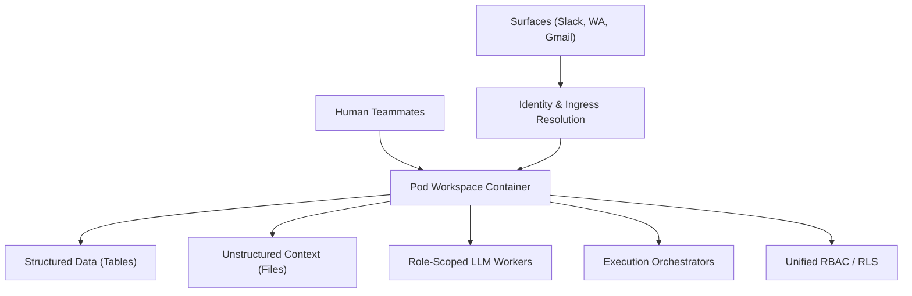

# Platform Mental Model

This document outlines the core structural mental model, conceptual paradigm, foundational shifts, and dependency architecture of the Lemma platform.

---

## 1. The Conceptual Paradigm: Local-First Multi-Agent Collaboration Workspace

Lemma is designed on a fundamental premise: **chat threads are insufficient environments for long-lived agent work.**

Instead of managing agents as transient API hooks inside standard chat boxes, Lemma treats agents, humans, tables, workflows, and tools as co-equal components within a single, persistent workspace called a **Pod**.



---

## 2. The Developer Mental Model Shifts

Standard software engineers transitioning to building on Lemma must adapt to five core architectural shifts:

### Shift 1: Chat is a Door, Not the Room
In typical LLM application development, the developer's scope starts and ends with a chat window or a sequence of conversation messages.
- **Old way:** Run an agent loop that outputs paragraphs of text or prints output to a console.
- **Lemma way:** The conversation is merely the entry interface. The ultimate destination for the agent's work is a structured **Table record** or a markdown **File** inside the Pod. The agent operates in the background, updating status fields, and inserting processed outputs into target tables.

### Shift 2: Unified Identity (Humans & Agents as Peers)
Lemma subjects both human operators and LLM agents to the exact same administrative and security policies.
- **Old way:** Run agents with an all-powerful, master API key, manually coding guards and access controls.
- **Lemma way:** An Agent is assigned a specific workspace role. It operates under Row-Level Security (RLS) constraints on Tables and visibility constraints on Folder structures. An agent can even have delegation tokens granted to execute connectors on behalf of specific users.

### Shift 3: Pause-and-Resume Asynchrony (Gated Runs)
Workflows and agent tasks in the real world span hours, days, or even weeks.
- **Old way:** Make long-lived HTTP requests with timeouts or manage complex, custom state-machines in database backends.
- **Lemma way:** Runs are designed to pause natively. When an agent calls `ask_user` or `request_approval`, the run session commits its current state and suspends (enters `WAITING` status). Once a human resolves the decision (via an App or Slack/WhatsApp surface), the platform resumes the execution by rebuilding the message history and starting a fresh, continuous execution run.

### Shift 4: Platform-as-a-Directory (Declarative Pods)
A Pod is represented completely by a local directory containing yaml/json/markdown configurations.
- **Old way:** Configure routes, schemas, and agent behaviors through custom code, database migrations, and administrative dashboards.
- **Lemma way:** Define your tables, agents, functions, and permissions declaratively in a folder. Version control it in Git. You can export a Pod from a cloud instance, run it locally on your laptop using Podman/Docker, and import it back seamlessly.

### Shift 5: Partitioning Reasoning vs. Determinism
- **Old way:** Let the LLM reason about everything, including formatting, validation, and calling API steps.
- **Lemma way:** Strictly separate LLM-based reasoning (**Agents**) from structured logic (**Functions**). Workflows orchestrate both, routing LLM choices into sandboxed Python execution steps for deterministic calculations and validation.

---

## 3. Core Dependencies & Primitive Layers

The platform's features are stratified into **Foundational Primitives** (strictly required for the workspace to function) and **Implementation/Delivery Layers** (syntactic sugar or optional interfaces).

```
┌───────────────────────────────────────────────────────────┐
│                    DELIVERY LAYERS                        │
│   Surfaces (Slack, Teams, WA)   │  Apps (UI Single Pages) │
├───────────────────────────────────────────────────────────┤
│                  ORCHESTRATION LAYERS                     │
│   Workflows (Graph Engine)      │  Connectors (OAuth)      │
├───────────────────────────────────────────────────────────┤
│                  FOUNDATIONAL PRIMITIVES                  │
│   Pod (Tenancy/RBAC)  │  Datastore (Tables/Files) │  Agent │
└───────────────────────────────────────────────────────────┘
```

### Foundational Primitives (The Core)
*   **Pod & Identity (`modules/pod`, `modules/identity`)**: The boundary of organization, authorization, and membership. Without this, no resources can be grouped or authenticated.
*   **Datastore (`modules/datastore`)**: Consists of database **Tables** (with RLS) and unstructured **Files** (with full-text vector index search). Represents the system memory.
*   **Agent (`modules/agent`)**: The core worker agent executor. Resolves LLM runtime profiles and routes agent turns.
*   **Workspace (`modules/workspace` / `agentbox`)**: The sandboxing runtime manager. Provides the secure execution container (AgentBox) where tools and functions are evaluated without compromising the host machine.

### Implementation Layers (Optional / Extensible)
*   **Workflows (`modules/workflow`)**: A convenience layer to coordinate multi-agent/function graphs. Optional; you can build complex systems using only tables, records, and agent tool execution.
*   **Surfaces (`modules/agent_surfaces`)**: Gateways that translate external messaging webhooks (Slack, WhatsApp, etc.) into platform events. If disabled, the platform remains fully functional via the API.
*   **Apps (`modules/apps`)**: A custom operator UI hosting layer. Users can alternatively manage everything via the terminal/CLI (`lemma-cli`).
*   **Connectors (`modules/connectors`)**: Integrations with third-party tools (e.g. via Composio). Optional; agents can still use standard web search or run custom sandbox Python code.
