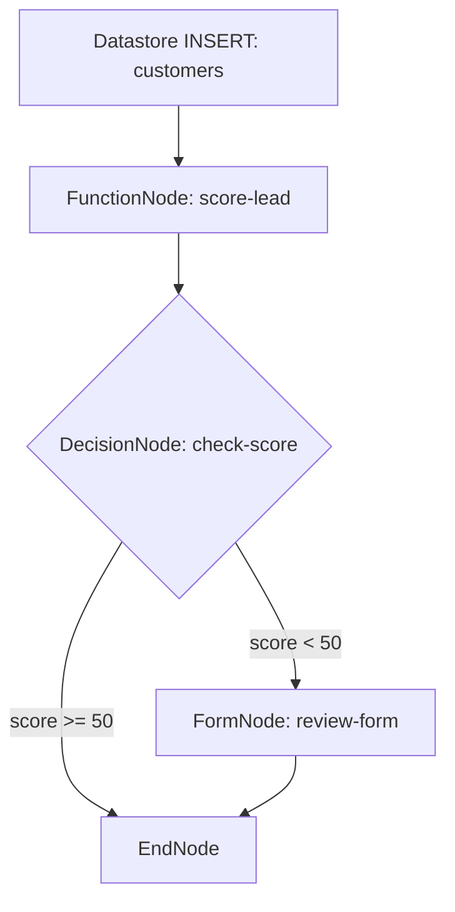

# Lemma Platform Schema Blueprints

This document serves as the formal source of truth for the programmatic schemas, Pydantic type definitions, and literal HTTP/WebSocket JSON payloads of the Lemma Platform. It defines the mapping of system-managed versus client-writeable fields and outlines the exact shapes needed for automated code generation and client integrations.

---

## 1. Pod Schema Blueprints

Pods are the primary organizational units within the Lemma Platform. They group members, datastores, agents, and workflows under a specific tenant context.

### Class Definitions

#### PodConfig (Pydantic Model)
Defines pod-level policy configurations.
```python
class PodJoinPolicy(str, Enum):
    INVITE_ONLY = "INVITE_ONLY"  # Default: Invitation or explicit join-request approval required
    ORG_MEMBERS = "ORG_MEMBERS"  # Any member of the pod's parent organization may self-join
    PUBLIC = "PUBLIC"            # Any registered Lemma user may self-join

class PodConfig(BaseModel):
    default_profile_id: str | None = None  # Default Agent Runtime Profile ID (Daemon or model API profile)
    join_policy: PodJoinPolicy = PodJoinPolicy.INVITE_ONLY
```

#### PodCreateRequest & PodUpdateRequest
```python
class PodCreateRequest(BaseModel):
    organization_id: UUID
    name: str                  # Max length 255, alphanumeric and underscores
    description: str | None = None
    icon_url: str | None = None
    config: PodConfig = Field(default_factory=PodConfig)

class PodUpdateRequest(BaseModel):
    name: str | None = None
    description: str | None = None
    icon_url: str | None = None
    config: PodConfig | None = None
```

#### PodResponse
```python
class PodResponse(BaseModel):
    id: UUID
    user_id: UUID
    organization_id: UUID
    name: str
    description: str | None = None
    icon_url: str | None = None
    config: PodConfig
    created_at: datetime
    updated_at: datetime
```

### Server-Populated vs. Client-Writeable Fields

| Field Name | Type | Writeable (Create/Update) | Read-Only (Server-Populated) | Description |
| :--- | :--- | :---: | :---: | :--- |
| `id` | `UUID` | | Yes | Unique identifier for the Pod |
| `user_id` | `UUID` | | Yes | Creator / owner of the Pod |
| `organization_id`| `UUID` | Yes (Create only) | Yes | Parent organization container |
| `name` | `str` | Yes | | Name of the Pod |
| `description` | `str` | Yes | | Long form description |
| `icon_url` | `str` | Yes | | Custom avatar URL |
| `config` | `object` | Yes | | Nested join policy & default runtime profile |
| `created_at` | `datetime` | | Yes | ISO 8601 creation timestamp |
| `updated_at` | `datetime` | | Yes | ISO 8601 modification timestamp |

### Complete JSON Payloads

#### Create Pod (`POST /pods`)
```json
{
  "organization_id": "8a7b9c1d-1234-5678-abcd-ef1234567890",
  "name": "sales_development",
  "description": "Pod for managing outbound CRM leads and pipelines.",
  "icon_url": "https://cdn.lemma.dev/icons/sales.png",
  "config": {
    "default_profile_id": "openai-gpt-4o-global",
    "join_policy": "ORG_MEMBERS"
  }
}
```

#### Update Pod (`PATCH /pods/{pod_id}`)
```json
{
  "name": "sales_development_north",
  "config": {
    "join_policy": "INVITE_ONLY"
  }
}
```

---

## 2. Table & Datastore Schema Blueprints

Tables provide schema-backed relational storage for Pod data. They support fine-grained datatypes, foreign keys, computed columns, and per-user Row Level Security (RLS).

### Class Definitions

#### DatastoreDataType (Enum)
Supported physical datatypes:
*   `TEXT`: Variable length text strings.
*   `FILE_PATH`: Reference path to the integrated file storage subsystem.
*   `INTEGER`: 64-bit integer values.
*   `FLOAT`: Double-precision floating-point numbers.
*   `BOOLEAN`: True/False values.
*   `JSON`: Arbitrary JSON structures.
*   `DATE`: Calendar date.
*   `DATETIME`: ISO timestamp with timezone.
*   `UUID`: 128-bit universally unique identifiers.
*   `USER`: Foreign key tracking a platform member.
*   `VECTOR`: Vector embeddings for similarity search.
*   `SERIAL`: Auto-incrementing integer sequence.
*   `ENUM`: Pre-defined set of string values.

#### ForeignKeySpec & ColumnSchema
```python
class ForeignKeySpec(BaseModel):
    references: str  # Target references format: "other_table_name.primary_key_column"

class ColumnSchema(BaseModel):
    name: str                         # Alphanumeric and underscores only
    type: DatastoreDataType
    description: str | None = None
    required: bool = False            # NOT NULL constraint
    unique: bool = False              # UNIQUE index constraint
    default: Any | None = None        # Literal default value
    foreign_key: ForeignKeySpec | None = None
    max_length: int | None = None     # Specific to TEXT data types
    options: list[str] | None = None  # Specific to ENUM values
    type_params: dict[str, Any] | None = None
    auto: bool = False                # Auto-populated (e.g. SERIAL columns)
    system: bool = False              # System columns (created_at, updated_at, user_id)
    computed: bool = False            # Generates virtual SQL values
    expression: str | None = None     # Whitelisted SQL logic (e.g. "COALESCE(first_name || ' ' || last_name)")
```

> [!WARNING]
> Computed column expressions are parsed and checked against a strict whitelist of pure functions (`COALESCE`, `NULLIF`, `GREATEST`, `LEAST`, `LOWER`, `UPPER`, `TRIM`, `LENGTH`, `ABS`, `ROUND`, `CONCAT`) and SQL operators to prevent DDL injection.

#### CreateTableRequest & UpdateTableRequest
```python
class CreateTableRequest(BaseModel):
    name: str                         # Name of the table. Cannot be prefixed with 'reserved_'
    primary_key_column: str = "id"    # Primary key column. Defaults to 'id'
    columns: list[ColumnSchema]
    config: dict[str, Any] | None = None
    enable_rls: bool = True           # Toggles Row Level Security (per-user ownership scoping)
    visibility: str | None = None     # Defaults to 'POD'

class UpdateTableRequest(BaseModel):
    config: dict[str, Any] | None = None
    visibility: str | None = None
    enable_rls: bool | None = None    # Allowed only on EMPTY tables
```

### Server-Populated vs. Client-Writeable Fields

```
Table Creation DDL Lifecycle:
Client Request columns
  └── (name, type, foreign_key, etc.)
Backend DDL Materialization
  ├── primary_key: "id" (if omitted, added as UUID type)
  ├── system: "created_at" (TIMESTAMP, default: now())
  ├── system: "updated_at" (TIMESTAMP, default: now())
  └── system: "user_id"    (UUID reference, added if enable_rls=True)
```

The server automatically injects system columns into the column schema list. Client requests must treat `system=True` and `auto=True` fields as read-only.

### Complete JSON Payloads

#### Create Table (`POST /pods/{pod_id}/datastore/tables`)
```json
{
  "name": "customers",
  "primary_key_column": "id",
  "enable_rls": true,
  "columns": [
    {
      "name": "id",
      "type": "UUID",
      "required": true,
      "unique": true,
      "auto": true
    },
    {
      "name": "email",
      "type": "TEXT",
      "required": true,
      "unique": true
    },
    {
      "name": "company_name",
      "type": "TEXT",
      "required": false
    },
    {
      "name": "status",
      "type": "ENUM",
      "options": ["LEAD", "CONTACTED", "CONVERTED", "CHURNED"],
      "default": "LEAD"
    },
    {
      "name": "lead_score",
      "type": "INTEGER",
      "default": 0
    }
  ],
  "config": {
    "display_icon": "users-check",
    "description": "Core customer profiles table."
  }
}
```

---

## 3. Record Payload Blueprints

Records are rows inside user datastore tables. Read and write operations conform to the schema defined for the table.

### Class Definitions

```python
class CreateRecordRequest(BaseModel):
    data: dict[str, Any]  # Dictionary mapping column names to serializable values

class UpdateRecordRequest(BaseModel):
    data: dict[str, Any]  # Partial dictionary payload containing columns to patch

class BulkCreateRecordsRequest(BaseModel):
    records: list[dict[str, Any]]
    upsert: bool = False  # If true, performs an INSERT ... ON CONFLICT DO UPDATE

class BulkUpdateRecordsRequest(BaseModel):
    records: list[dict[str, Any]]  # Each item MUST contain the primary key key-value pair

class BulkDeleteRecordsRequest(BaseModel):
    record_ids: list[str | int | UUID]
```

### Row Level Security (RLS) Mechanics

When reading or modifying records, the platform supports `RecordAccessMode`:
*   `USER` (Default): Evaluates RLS policies. The server automatically filters reads and injects `user_id` ownership on writes to scope data to the current authenticated caller.
*   `ADMIN`: Bypasses RLS scoping. This is only available to users with administrator grants for that specific table resource.

System columns `created_at`, `updated_at`, and `user_id` are automatically populated by the database engine on write. They are ignored if passed in write payloads.

### Complete JSON Payloads

#### Create Record (`POST /pods/{pod_id}/datastore/tables/{table_name}/records`)
```json
{
  "data": {
    "email": "customer@acme.org",
    "company_name": "Acme Corp",
    "status": "LEAD",
    "lead_score": 75
  }
}
```

#### Response (Created Record)
```json
{
  "id": "e4b1c2d3-1234-5678-abcd-ef1234567890",
  "email": "customer@acme.org",
  "company_name": "Acme Corp",
  "status": "LEAD",
  "lead_score": 75,
  "user_id": "4fc2061b-49b1-4419-b6f2-9765ccad3c13",
  "created_at": "2026-06-27T14:55:00Z",
  "updated_at": "2026-06-27T14:55:00Z"
}
```

#### Bulk Create / Upsert (`POST /pods/{pod_id}/datastore/tables/{table_name}/records/bulk-create`)
```json
{
  "records": [
    {
      "email": "alice@company.com",
      "company_name": "Company A",
      "status": "CONTACTED"
    },
    {
      "email": "bob@company.com",
      "company_name": "Company B",
      "status": "LEAD"
    }
  ],
  "upsert": true
}
```

---

## 4. Workflow Schema Blueprints

Workflows represent stateful execution graphs. They are triggered manually, on a schedule, via external events, or via datastore modifications.

### Class Definitions

#### Workflow Graph Structure
```python
class WorkflowEdge(BaseModel):
    id: str
    source: str
    target: str
    label: str | None = None

class NodeType(str, Enum):
    FORM = "FORM"
    AGENT = "AGENT"
    FUNCTION = "FUNCTION"
    DECISION = "DECISION"
    LOOP = "LOOP"
    WAIT_UNTIL = "WAIT_UNTIL"
    END = "END"

class BaseNode(BaseModel):
    id: str
    label: str | None = None
    position: dict[str, float] | None = None  # UI layout coordinates: {"x": float, "y": float}
```

#### Workflow Node Configurations
```python
class ExpressionInputBinding(BaseModel):
    type: Literal["expression"] = "expression"
    value: str  # JMESPath expression evaluated against the execution context

class LiteralInputBinding(BaseModel):
    type: Literal["literal"] = "literal"
    value: Any  # Pure JSON literal value

InputBinding = ExpressionInputBinding | LiteralInputBinding

# 1. Agent Execution Node
class AgentNodeConfig(BaseModel):
    agent_name: str
    input_mapping: dict[str, InputBinding] = {}

class AgentNode(BaseNode):
    type: Literal[NodeType.AGENT] = NodeType.AGENT
    config: AgentNodeConfig

# 2. Function Execution Node
class FunctionNodeConfig(BaseModel):
    function_name: str
    input_mapping: dict[str, InputBinding] = {}

class FunctionNode(BaseNode):
    type: Literal[NodeType.FUNCTION] = NodeType.FUNCTION
    config: FunctionNodeConfig

# 3. Interactive Form Node (Human-in-the-Loop)
class FormNodeConfig(BaseModel):
    input_schema: dict[str, Any]                    # Form fields JSON schema
    ui_schema: dict[str, Any] = {}                  # UI display config schema
    assignee_pod_member_id: UUID | None = None      # Static assignee
    assignee_pod_member_id_expression: str | None = None  # Dynamic assignee (JMESPath expression)

class FormNode(BaseNode):
    type: Literal[NodeType.FORM] = NodeType.FORM
    config: FormNodeConfig

# 4. Decision Branching Node
class DecisionRule(BaseModel):
    condition: str      # JMESPath condition. Evaluates truthiness. E.g. "agent_run.lead_score > 50"
    next_node_id: str

class DecisionNodeConfig(BaseModel):
    rules: list[DecisionRule] = []

class DecisionNode(BaseNode):
    type: Literal[NodeType.DECISION] = NodeType.DECISION
    config: DecisionNodeConfig

# 5. Iterative Loop Node
class LoopNodeConfig(BaseModel):
    items_path: str                 # JMESPath to an array. E.g. "fetch_records.results"
    item_var_name: str = "item"     # Accessible context key inside loop body
    child_node_id: str              # Entry node for the loop sequence

class LoopNode(BaseNode):
    type: Literal[NodeType.LOOP] = NodeType.LOOP
    config: LoopNodeConfig

# 6. Wait / Sleep Node
class WaitUntilNodeConfig(BaseModel):
    timeout_seconds: int

class WaitUntilNode(BaseNode):
    type: Literal[NodeType.WAIT_UNTIL] = NodeType.WAIT_UNTIL
    config: WaitUntilNodeConfig

# 7. Workflow Completion Node
class EndNodeConfig(BaseModel):
    pass

class EndNode(BaseNode):
    type: Literal[NodeType.END] = NodeType.END
    config: EndNodeConfig = Field(default_factory=EndNodeConfig)

WorkflowNode = FormNode | AgentNode | FunctionNode | DecisionNode | LoopNode | WaitUntilNode | EndNode
```

#### Workflow Trigger (FlowStart) Definitions
```python
class FlowStartType(str, Enum):
    MANUAL = "MANUAL"
    SCHEDULED = "SCHEDULED"
    EVENT = "EVENT"
    DATASTORE_EVENT = "DATASTORE_EVENT"

class ScheduledFlowStartType(str, Enum):
    ONCE = "ONCE"
    CRON = "CRON"

class ScheduledFlowStart(BaseModel):
    schedule_type: ScheduledFlowStartType

class EventFlowStart(BaseModel):
    connector_id: str
    connector_trigger_id: str
    trigger_config: dict[str, Any] = {}

class DataStoreFlowStart(BaseModel):
    table_name: str
    operations: list[str]  # Substrings of: "INSERT", "UPDATE", "DELETE"

class FlowStart(BaseModel):
    type: FlowStartType
    config: ScheduledFlowStart | EventFlowStart | DataStoreFlowStart | None = None
```

#### Workflow API Requests
```python
class WorkflowCreateRequest(BaseModel):
    name: str
    description: str | None = None
    icon_url: str | None = None
    start: FlowStart | None = None
    mode: str = "GLOBAL"  # GLOBAL or USER
    visibility: ResourceVisibility = ResourceVisibility.POD
    nodes: list[WorkflowNode] = []
    edges: list[WorkflowEdge] = []

class WorkflowGraphUpdateRequest(BaseModel):
    nodes: list[WorkflowNode]
    edges: list[WorkflowEdge]
    start: FlowStart | None = None
```

### Complete JSON Payloads

#### Update Workflow Graph (`PUT /pods/{pod_id}/workflows/{workflow_id}/graph`)
The payload below represents a workflow that triggers on database insertions into the `customers` table, runs a lead scoring function, branches via a decision node based on the score, and suspends for human approval via a FormNode if the score is low.



```json
{
  "start": {
    "type": "DATASTORE_EVENT",
    "config": {
      "table_name": "customers",
      "operations": ["INSERT"]
    }
  },
  "nodes": [
    {
      "id": "score_lead",
      "type": "FUNCTION",
      "label": "Score Lead Profiles",
      "position": {"x": 100, "y": 100},
      "config": {
        "function_name": "score-lead",
        "input_mapping": {
          "email": {
            "type": "expression",
            "value": "start.payload.email"
          },
          "company": {
            "type": "expression",
            "value": "start.payload.company_name"
          }
        }
      }
    },
    {
      "id": "check_score",
      "type": "DECISION",
      "label": "Check Score Priority",
      "position": {"x": 100, "y": 250},
      "config": {
        "rules": [
          {
            "condition": "score_lead.output_data.score >= 50",
            "next_node_id": "end_flow"
          }
        ]
      }
    },
    {
      "id": "review_form",
      "type": "FORM",
      "label": "Manual Lead Review Form",
      "position": {"x": 300, "y": 400},
      "config": {
        "input_schema": {
          "type": "object",
          "properties": {
            "justification": {
              "type": "string",
              "title": "Approval Justification"
            },
            "override_status": {
              "type": "string",
              "enum": ["APPROVED", "REJECTED"],
              "title": "Override Status"
            }
          },
          "required": ["justification", "override_status"]
        },
        "assignee_pod_member_id_expression": "start.payload.user_id"
      }
    },
    {
      "id": "end_flow",
      "type": "END",
      "label": "Workflow Complete",
      "position": {"x": 100, "y": 550},
      "config": {}
    }
  ],
  "edges": [
    {
      "id": "edge_1",
      "source": "score_lead",
      "target": "check_score"
    },
    {
      "id": "edge_2",
      "source": "check_score",
      "target": "review_form",
      "label": "Score < 50 (Fallthrough)"
    },
    {
      "id": "edge_3",
      "source": "review_form",
      "target": "end_flow"
    }
  ]
}
```

---

## 5. Tool Calls & Real-Time Event Payloads

Communication between Agent runtimes, workflows, MCP servers, and clients is managed via structured API payloads and asynchronous WebSocket event streams.

### Class Definitions

#### Message & Tool Call Structs (Pydantic Models)
```python
class MessageRole(str, Enum):
    USER = "user"
    ASSISTANT = "assistant"
    SYSTEM = "system"
    TOOL = "tool"

class MessageKind(str, Enum):
    TEXT = "TEXT"                  # Assistant conversational text output
    NOTIFICATION = "NOTIFICATION"  # System logs or process announcements
    THINKING = "THINKING"          # Model reasoning trace tokens
    TOOL_CALL = "TOOL_CALL"        # Outbound call containing arguments
    TOOL_RETURN = "TOOL_RETURN"    # Inbound response containing execution output

class MessageResponse(BaseModel):
    id: UUID
    conversation_id: UUID
    sequence: int
    agent_run_id: UUID | None
    role: MessageRole
    kind: MessageKind
    text: str | None = None
    tool_name: str | None = None
    tool_call_id: str | None = None
    tool_args: Any | None = None
    tool_result: Any | None = None
    metadata: dict[str, Any] | None = None
    created_at: datetime
```

### WebSocket Streaming Channels

The platform uses two core WebSocket interfaces:
1.  **Datastore Changes Channel**: Stream record changes directly to the client.
2.  **Daemon Integration Channel**: Bidirectional coordination between the platform and daemon-backed Agent runtimes.

---

### Datastore Changes WS Protocol
**Path**: `/pods/{pod_id}/datastore/changes`
**Parameters**:
*   `table` (Optional): Restricts stream to changes in a single table.
*   `since` (Optional): Redis stream ID to replay missed mutations from.

#### Server Frame: Connection Ready
Sent immediately after the connection is accepted.
```json
{
  "type": "ready",
  "since": "1719500000000-0"
}
```

#### Server Frame: Record Event Stream
Emitted on record creation, updates, or deletions.
```json
{
  "type": "datastore.record.INSERT",
  "pod_id": "a1b2c3d4-1234-5678-abcd-ef1234567890",
  "table_name": "customers",
  "record_id": "e4b1c2d3-1234-5678-abcd-ef1234567890",
  "operation": "INSERT",
  "payload": {
    "id": "e4b1c2d3-1234-5678-abcd-ef1234567890",
    "email": "lead@client.com",
    "company_name": "Acme Inc",
    "status": "LEAD"
  },
  "occurred_at": "2026-06-27T14:55:05Z",
  "stream_id": "1719500001254-0"
}
```

---

### Daemon WS Protocol
**Path**: `/me/agent-runtime/daemon/ws`
**Headers**:
*   `Authorization`: `Bearer <LEMMA_TOKEN>`

#### 1. Daemon Handshake (Client → Server)
Announces the daemon's availability, connected hardware state, and model capability catalog.
```json
{
  "type": "daemon.ready",
  "payload": {
    "device_key": "host-mac-address-or-machine-uuid",
    "display_name": "Developer MacBook Daemon",
    "device_info": {
      "os": "darwin",
      "arch": "arm64"
    },
    "harness_catalog": {
      "LEMMA": {
        "available": true,
        "models": ["gpt-4o", "gpt-4-turbo", "claude-3-5-sonnet"]
      }
    }
  }
}
```

#### 2. Handshake Acknowledgement (Server → Client)
```json
{
  "type": "daemon.ready_ack",
  "daemon_id": "c1a2b3c4-90ab-cdef-1234-567890abcdef"
}
```

#### 3. Heartbeat / Keepalive (Client → Server & Server → Client)
```json
{ "type": "daemon.ping" }
```
*Server replies with:*
```json
{ "type": "daemon.pong" }
```

#### 4. Run Execution Trigger (Server → Client)
Instructs the host daemon to spin up an agent instance. The payload includes instructions, context, workspace targets, and the Lemma MCP server access token.
```json
{
  "type": "run.start",
  "agent_run_id": "9a8b7c6d-5432-10fe-dcba-0987654321fe",
  "payload": {
    "agent_run_id": "9a8b7c6d-5432-10fe-dcba-0987654321fe",
    "conversation_id": "4fc2061b-49b1-4419-b6f2-9765ccad3c13",
    "harness_kind": "LEMMA",
    "model_name": "gpt-4o",
    "prompt": {
      "user_prompt": "USER:\nCreate a summary folder in our files section and compile our leads list.",
      "system_prompt": "# Instructions\nYou are a file manager agent. Help users organize work.\n\n# Runtime\nYou are running through a Lemma user daemon. Use the Lemma MCP tools (the lemma_* tools) for file and command execution."
    },
    "mcp": {
      "server_name": "lemma-mcp-server",
      "url": "https://api.lemma.dev/agent-runtime/conversations/4fc2061b-49b1-4419-b6f2-9765ccad3c13/mcp",
      "token": "workspace-mcp-auth-token",
      "run_id": "9a8b7c6d-5432-10fe-dcba-0987654321fe",
      "workspace": {
        "id": "c4d3e2f1-5678-abcd-ef12-34567890abcdef",
        "cwd": "/workspace/conversations/4fc2061b-49b1-4419-b6f2-9765ccad3c13"
      },
      "tool_names": ["lemma_files_create_directory", "lemma_files_write_file"]
    }
  }
}
```

#### 5. Streaming Execution Events (Client → Server)
Emitted by the daemon to pipe assistant tokens, reasoning traces, tool invocations, and billable token usage metrics back to the platform.
```json
{
  "type": "run.event",
  "agent_run_id": "9a8b7c6d-5432-10fe-dcba-0987654321fe",
  "event": {
    "type": "TOKEN",
    "data": "Creating the directory..."
  }
}
```

```json
{
  "type": "run.event",
  "agent_run_id": "9a8b7c6d-5432-10fe-dcba-0987654321fe",
  "event": {
    "type": "MESSAGE",
    "data": {
      "role": "assistant",
      "kind": "TOOL_CALL",
      "tool_name": "lemma_files_create_directory",
      "tool_call_id": "call_abc123",
      "tool_args": {
        "path": "/workspace/conversations/4fc2061b-49b1-4419-b6f2-9765ccad3c13/summary"
      }
    }
  }
}
```

```json
{
  "type": "run.event",
  "agent_run_id": "9a8b7c6d-5432-10fe-dcba-0987654321fe",
  "event": {
    "type": "USAGE",
    "data": {
      "model_name": "gpt-4o",
      "usage_kind": "llm",
      "input_tokens": 1240,
      "output_tokens": 85,
      "tool_call_count": 1
    }
  }
}
```

```json
{
  "type": "run.event",
  "agent_run_id": "9a8b7c6d-5432-10fe-dcba-0987654321fe",
  "event": {
    "type": "COMPLETED",
    "data": "Process finished successfully."
  }
}
```
