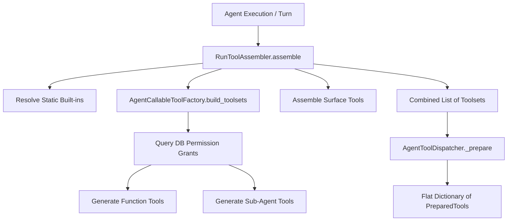

# Lemma Tool Integration and Resolution Ecosystem

This document describes how the platform registers, discovers, matches, and executes tools, covering Model Context Protocol (MCP) support, external tooling integrations (Composio/Lemma Connectors), dynamic discovery, and schema declarations.

---

## 1. Model Context Protocol (MCP) Support

Lemma has native, request-scoped support for the **Model Context Protocol (MCP)**. This is designed so that external developer tools or daemon harnesses (such as Codex, Claude-Code, or OpenCode) can interact directly with Lemma conversations.

- **MCP Entry Point**: The protocol is exposed via a WebSockets/SSE FastMCP server endpoint located at:
  `/agent-runtime/conversations/{conversation_id}/mcp`
- **MCP Adapter Service**: The `ConversationMCPService` class (in `app/modules/agent/services/conversation_mcp_service.py`) acts as the wire-format translator:
  - **Tool Listing**: `ConversationMCPService.list_tools` resolves all active tools for the agent and translates them into `mcp.types.Tool` schemas, prefixing tool names with `lemma_` to prevent namespace collision (e.g. `lemma_exec_command`).
  - **Tool Execution**: `ConversationMCPService.call_tool` normalizes the name via `normalize_local_mcp_tool_name` (defined in `app/modules/agent/infrastructure/mcp.py`) and routes the call to the central `AgentToolDispatcher`.
  - **Error Translation**: Execution failures are caught at the boundary and returned as `CallToolResult(isError=True)` with structured diagnostic payloads so the client LLM can recover rather than aborting.

---

## 2. Composio & External Tooling Integration

For external SaaS connections (like Slack, Google Calendar, or Github), Lemma utilizes a dual gateway setup routing through either native connectors or the **Composio Action Network**:

- **Credential Resolution**: When an agent attempts to call a tool, the `AccountResolutionService` and `ConnectorService` resolve the user's connection credentials (e.g., retrieving the third-party `connection_id` for Composio, or API keys/OAuth access tokens for Lemma).
- **Execution Gateways**:
  - `RoutingOperationGateway` (in `app/modules/connectors/infrastructure/adapters/routing_operation_gateway.py`) inspects the connector's `AuthProvider`:
    - `AuthProvider.LEMMA` is routed to `LemmaOperationGateway`.
    - `AuthProvider.COMPOSIO` is routed to `ComposioOperationGateway`.
  - `ComposioOperationGateway` (in `app/modules/connectors/infrastructure/adapters/composio_operation_gateway.py`):
    - Initializes the `Composio` SDK client using `connector_settings.composio_api_key`.
    - Invokes the action using `composio.tools.execute(operation_name, payload, connected_account_id=connection_id)`.
    - Since the Composio SDK makes synchronous network calls, the gateway offloads the request to a worker thread using `asyncio.to_thread` to protect the main event loop from blocking.

---

## 3. Tool Discovery and Selection

At runtime, the platform dynamically resolves the available toolset for any given agent conversation.



- **RunToolAssembler** (`app/modules/agent/tools/tool_assembler.py`):
  Combines static built-in toolsets (e.g. `workspace_cli_toolset`, `pod_toolset`, `skills_toolset`) with dynamic toolsets.
- **Dynamic Tool Resolution** (`app/modules/agent/tools/callable_tool_factory.py`):
  - `AgentCallableToolFactory` queries the database permission table (`ResourcePermissionGrantModel`) using the Agent's ID.
  - It identifies all `FunctionEntity` (database-registered custom functions) and other `Agent` instances (sub-agents) that this agent has authorization to execute (`Permissions.FUNCTION_EXECUTE`, `Permissions.AGENT_EXECUTE`).
  - Dynamic tools are compiled into pydantic-ai tool definitions.
- **Dispatcher Preparation** (`app/modules/agent/tools/dispatcher.py`):
  `AgentToolDispatcher._prepare` takes the assembled list, resolves them against the runtime environment context (`BaseAgentContext`), and caches them in a flat dictionary mapping by name as `PreparedTool` objects.

---

## 4. Schema Declaration & Validation

Tools present their input requirements and parameters to LLMs using standard **JSON Schema** formats:

- **JSON Schema Normalization**:
  In `AgentCallableToolFactory`, the database-stored JSON schema for custom functions (`function.input_schema`) is parsed and normalized. Pydantic-AI's `InlineDefsJsonSchemaTransformer` inlines references to create an standalone schema block compatible with LLM tool-calling conventions.
- **Validation Phase**:
  Before executing any tool, the `AgentToolDispatcher._validate_arguments` method validates the model's generated JSON arguments against the tool's validator:
  ```python
  validated = tool.tool.args_validator.validate_python(
      arguments,
      context=run_ctx.validation_context,
  )
  ```
- **Fallback for Plain Sub-Agents**:
  If a child agent does not have a formal `input_schema` defined, `AgentCallableToolFactory` generates a single-field input schema:
  ```json
  {
      "type": "object",
      "properties": {
          "input": {
              "type": "string",
              "description": "The task or question for the agent, in natural language."
          }
      },
      "required": ["input"],
      "additionalProperties": false
  }
  ```
